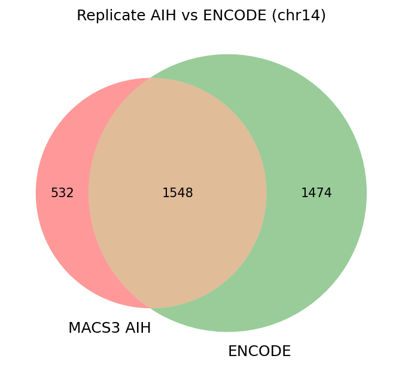
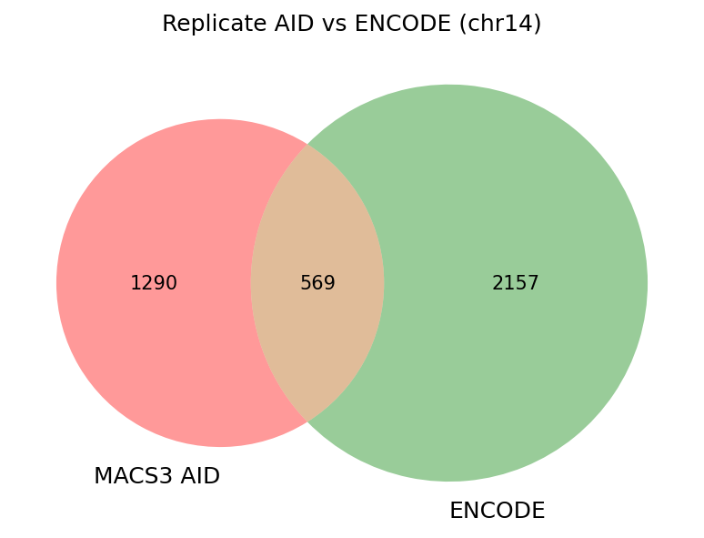
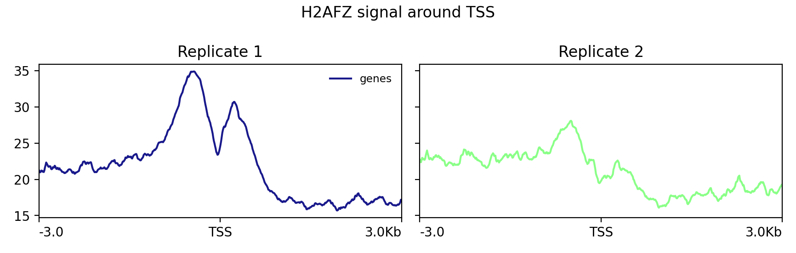

# ДЗ №3 по биоинформатике

[Ссылка на ноутбук](https://colab.research.google.com/drive/1JP7fULDid2ftfXu9CifyKejgqgfYmKie?usp=sharing)

---

## Описание клеточной линии

Был выбран эксперимент [ENCSR000AUG](https://www.encodeproject.org/experiments/ENCSR000AUG/), клеточная линия A549, гистоновая метка H2AFZ.

Данные о биосэмпле получены [отсюда](https://www.encodeproject.org/biosamples/ENCBS160AAA/):

| Параметр | Значение |
|---|---|
| Тип ткани | Эпителий лёгкого (аденокарцинома) |
| Пол | Мужской |
| Возраст | 58 лет |

---

## Статистика выравнивания

| Образец | Всего ридов | Уникальных выравниваний | Неуникальных выравниваний | Не выравнилось |
|---|---|---|---|---|
| ENCFF000AIH (реплика 1) | 56 042 218 | 2 513 581 (4.49%) | 6 651 442 (11.87%) | 46 877 195 (83.65%) |
| ENCFF000AID (реплика 2) | 23 703 214 | 958 554 (4.04%) | 3 073 534 (12.97%) | 19 671 126 (82.99%) |
| ENCFF000AHJ (контроль) | 38 269 770 | 1 784 261 (4.66%) | 5 210 378 (13.61%) | 31 275 131 (81.72%) |

Процент выравнивания довольно низкий -- в районе 17% в среднем. Это можно объяснить тем, что выравнивание производилось лишь на одну, 14-ю, хромосому, а риды расположены по всему геному.

---

## FastQC

FastQC был запущен на трёх fastq файлах (реплика 1, реплика 2, контроль). Критичных проблем с качеством обнаружено не было:

- **Per base sequence quality** -- pass для всех трёх файлов
- **Adapter Content** -- снова pass для всех трёх файлов
- **Per base sequence content** -- warning для реплики 1 и контроля (вероятно, из-за праймеров, так что ничего критичного)
- **Per sequence GC content** -- warning для реплики 1 и контроля, fail для реплики 2 (а тут, скорее всего, из-за меньшего числа ридов во 2 реплике)

Исходя из всего этого, тримминг не проводился.

---

## Диаграммы Венна

Для сравнения использовался файл ENCODE реплицированных пиков [ENCFF780OWC](https://www.encodeproject.org/files/ENCFF780OWC/) (bed narrowPeak, GRCh38), отфильтрованный по chr14.

### Реплика 1 (ENCFF000AIH)

### Реплика 2 (ENCFF000AID)

Реплика 1 демонстрирует хорошее перекрытие с ENCODE, но реплика 2 показывает втрое меньшее перекрытие, что можно объяснить меньшим числом ридов и, соответственно, меньшей статистической уверенностью при вызове пиков. Пики, присутствующие в ENCODE, но отсутствующие у нас, вероятно, находятся на других хромосомах (ENCODE использует весь геном), либо требуют большей глубины секвенирования для обнаружения на chr14.

---

## Бонус №1

Анализ проводился с помощью deeptools. Сигнал строился в окне $\pm$ 3 kb вокруг TSS генов (аннотация GENCODE v38, hg38).

### Вывод

На графике реплики 1 чётко виден двойной пик непосредственно у TSS с провалом между ними. Реплика 2 показывает тот же паттерн, но менее выраженно из-за меньшей глубины секвенирования (23 млн ридов против 56 млн).

Полученное распределение не полностью, но согласуется с данными Li et al. (2007). В статье пик смещён немногим левее, чем у полученных графиков, но сама динамика схожая.